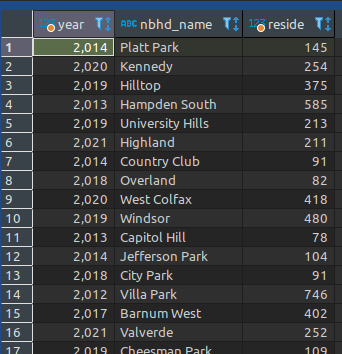

## Slope Mapping - Exploring a New Type of Temporal Mapping

This article will explore how to use the slope value of a trend line to create a map showing population growth and decline over 10 years of data. 

Recently we (finally) received the 2020 Census data, which not only kicked off a flurry of mapping that data, but also made us think about how to create temporal maps of our student-level data over the same time period of 2010-2020. 

Luckily for us, we have data for every year between the Census decades, which gives us a very accurate picture of how are students are moving around. 

### Counting Students by Neighborhood 

For each year we want to count how many K-5 students live in each Denver neighborhood. 

We can do that with the following PostGIS SQL: 

    select
            year::int
            , n.nbhd_name
            , count(*) as reside
        from
            dpsdata."OctoberCount_Archive" as o
        join ccd."CCD_Neighborhoods" as n on
            ST_Intersects(
                o.geom
                , n.geom
            )
        where
            1 = 1
            and o.adjgradecrd in (
                '00', '01', '03', '04', '05'
            )
            and o."year" >= '2011'
        group by
            n.nbhd_id
            , o."year"

...which gives us back a count of students residing in each neighborhood for each year in question (in no particular order): 

### Visualizing Non-Spatial Temporal Change

One quick and dirty way to see how each neighborhood has changed over time is to simply dump the results into a spreadsheet, then pivot to order the counts by year. We use the Google Drive system at DPS, so I'll use the Google Spreadsheet tools for this next portion: 

 *NOTE: I've removed any values below 15 for data privacy reasons*  

From there, I can create a quick Line chart to show the reside counts by year by neighborhood:

That's not my favorite way to see the change over time, but you can definitely see there are some patterns - some neighborhoods are flat, some are in decline, and some continue to grow - in some cases quite rapidly. But there's just too many lines and no way to make sense of it all.

### Trend Lines in Spreadsheet Line Charts

Adding a trend line can give another quick look at the average increase/decrease of a neighborhood. 

Here's a few trendlines manually applied to the top neighborhoods on our line chart:

Again, not my favorite, and would have to be applied to all lines and that would make things very messy.

But the trendline itself is meaningful, and represents the average change over that 10 year period, and each year in between. If the slope of the trendline for each neighborhood could be shown on a map, what would that look like? 

### Calulating Slope in a Spreadsheet

To calculate the slope of the trendline for each neighborhood, we'll first use this Google Sheets formula:

    SLOPE(data_y, data_x)

Data_Y being values to plot on the Y-axis (population), and Data_X being the corresponding time series for the X-axis (year)

Applied to our data, it looks like this (with an additional conditional formatting applied to the values):

With the addition of the color ramp in the conditional formatting of the slope values, it would be great to see how that looks on a map. 

### Calculating Slope in PostgreSQL with regr_slope(y, x)

Now that Google Sheets has allowed us to explore the possibilities of using slope as a thematic mapping value, let's go back to the database and apply the slope function to our data without having to export it to a spreadsheet, pivot the data, etc. Once we're there, we'll also attach the geometry from the neighborhoods.

After a bit of digging, I found that indeed there is a slope function in Postgresql - [regr_slope(y,x)](https://www.postgresql.org/docs/14/functions-aggregate.html)

I was quickly able to figure out that pointing that function at a subquery of the data we pulled at the beginning of this page made it easy to calculate the exact same values I created in the Google Sheet without doing any extra exporting/copying, formatting or pivoting of the data:

    --first create a subquery using a common table expression called 's'
    
    ;with s as (
        select
            year::int
            , n.nbhd_name
            , n.nbhd_id
            , count(*) as reside
        from
            dpsdata."OctoberCount_Archive" as o
        join ccd."CCD_Neighborhoods" as n on
            ST_Intersects(
                o.geom
                , n.geom
            )
        where
            1 = 1
            and o.adjgradecrd in (
                '00', '01', '03', '04', '05'
            )
            and o."year" >= '2011'
        group by
            n.nbhd_id
            , o."year"
    )
    
    --use the subquery to calculate the slope from s
    --include the neighborhood name and id
    --join back to the neighborhoods PostGIS table and include the geometry 
    select
        s.nbhd_name
        , s.nbhd_id
        , regr_slope(s.reside, s.year)
        , h.geom
    from
        s

    --uncomment below to dump the results into a new table 
    --into public.slope_reside_change_2011_2020
    
    join ccd."CCD_Neighborhoods" as h on
        s.nbhd_id = h.nbhd_id
    group by
        s.nbhd_name
        , s.nbhd_id
        , h.geom

This is the result: 

Same values as the Google Sheets function! And we didn't leave the database, and we grabbed the geometry for the neighborhoods along the way. With the use of the 'into' statement, you can create a new table from the results of the query. We're ready to look at the results in QGIS.

### Mapping Slope in QGIS

After bringing the layer into QGIS, I did some inspection of the data and decided on the following buckets and colors using a diverging (color-blind friendly) color scheme (from ColorBrewer.org):

I like it - a lot, actually! Usually we are looking at change over just 2 time periods - either 1 year apart, or 5 or 10 years apart... but being able to show the average change over 10 years including all years in between is fantastic!

Since our SQL query included the Neighborhood name, we can use that as labels.

### What does this all mean? 
The bottom line for this analysis is that slope = average number per year of student increase or decrease in a neighborhood, and mapping this value is a great visual to show this change over 10 years as even the years in between can have an impact on the overall trend of growth and decline. 

Unfortunately we have something we refer to as the "Denver Pattern" in a lot of the demographic data points we analyze, and this map fits that pattern - decline in the SW and N/Central parts of the city, growth in the NE/Far Northeast, and basically flat growth in the SE part of the City. 

This map also fits with our analysis that shows some neighborhoods, especially in NW Denver are rebounding from the effects of gentrification, and more K-5 students are returning to the neighborhoods after several years of decline. This fits with the patterns in the number of births we see in these neighborhoods as well.

### Comments or Suggestions?

This is bit of an experiment, and I wonder what thoughts anyone has about this method? Please send us an email to [planning@dpsk12.org](mailto:planning@dpsk12.org)  or on Twitter [@dpsspatial](https://twitter.com/dpsspatial). 

